# md
how to md files.

## 書式
**太文字**

*斜体*

***太字斜体***

<u>ここに下線</u>
※githubでは表現不可(2025/11/15)

`ハイライト`

## Outline がカーソルを追いかけるようにする(VSCode)
* OUTLINE ペインの右上にある「カーソルに追従 (Follow Cursor)」アイコン をクリックしてオンにする
 
## マークダウンで表現できる図

※VSCode では「Markdown Preview Mermaid Support」 などの拡張機能を入れると、
mermaid … ブロックがプレビューで図として表示されます。

### 1-1. 画像（いわゆる“図”）


### テーブル
| 項目   | 説明               |
|--------|--------------------|
| 名前   | サンプル           |
| バージョン | 1.0            |

### 箇条書き
- プロジェクト
  - フロントエンド
    - React
  - バックエンド
    - Python
      - FastAPI

### チェックリスト
- [x] 要件定義
- [ ] 設計
- [ ] 実装
- [ ] テスト

### ディレクトリ構造の図（ASCIIアート）
```
project-root/
├─ src/
│ ├─ main.py
│ └─ utils.py
└─ README.md
```

### フローチャート（flowchart）

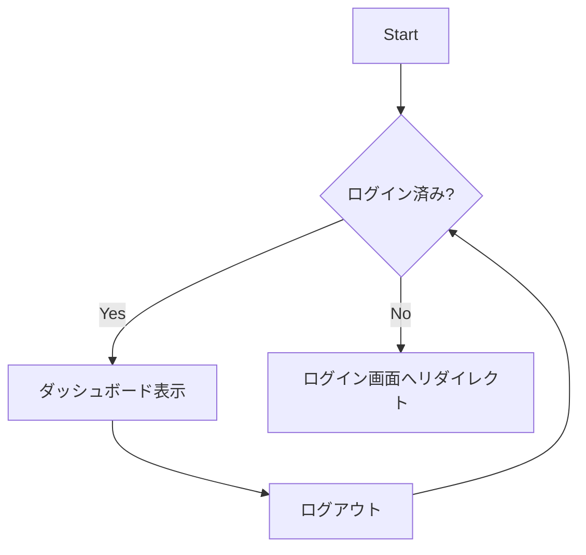

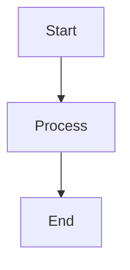


---
### 2-2. シーケンス図（sequenceDiagram）
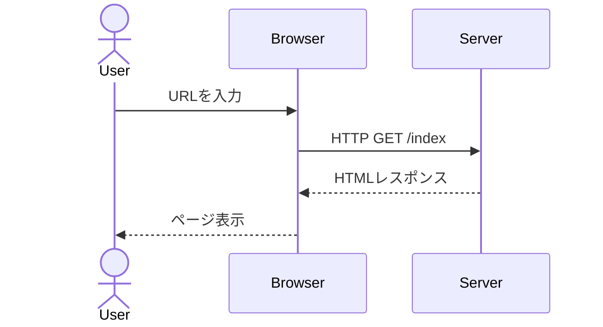

---
### 2-3. クラス図（classDiagram）
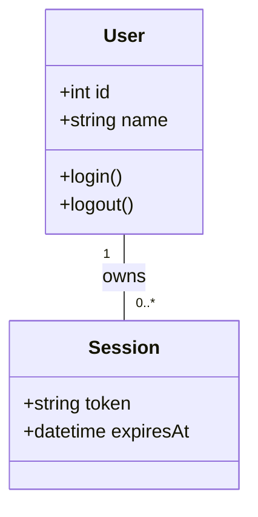

---
### 2-4. 状態遷移図（stateDiagram）
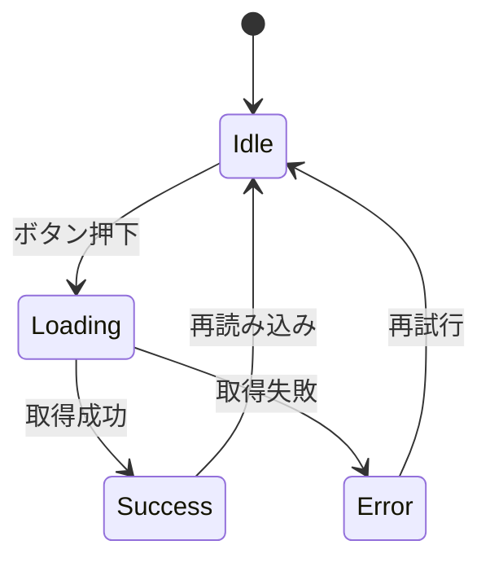

---
### 2-5. ER 図（erDiagram）
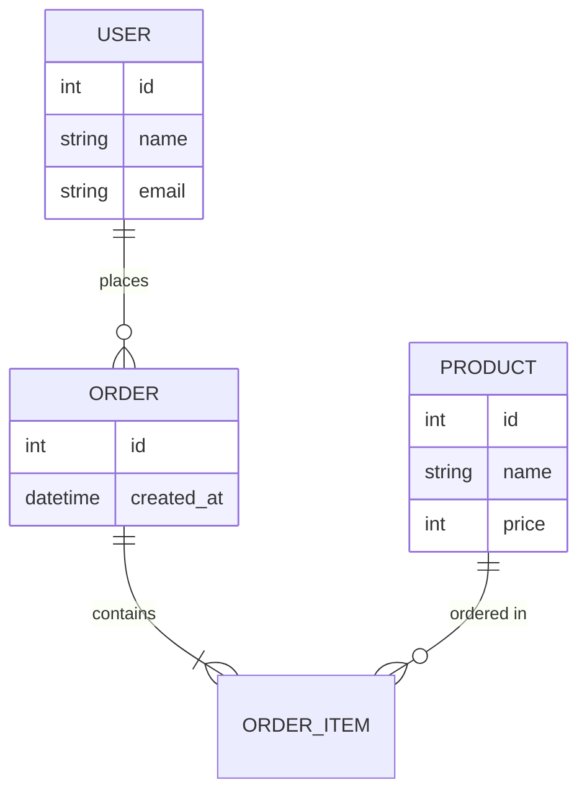

---
### 2-6. ガントチャート（gantt）
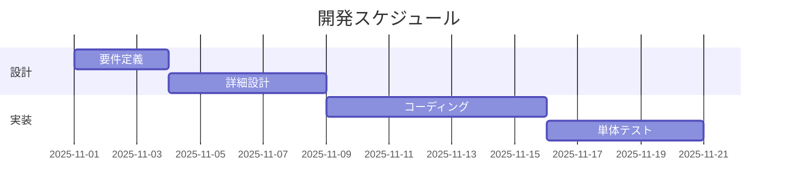

---
### 2-7. 円グラフ（pie）
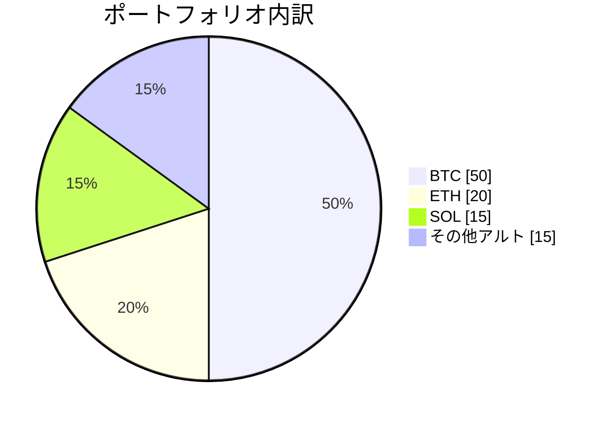


---
### 2-8. タイムライン（timeline）
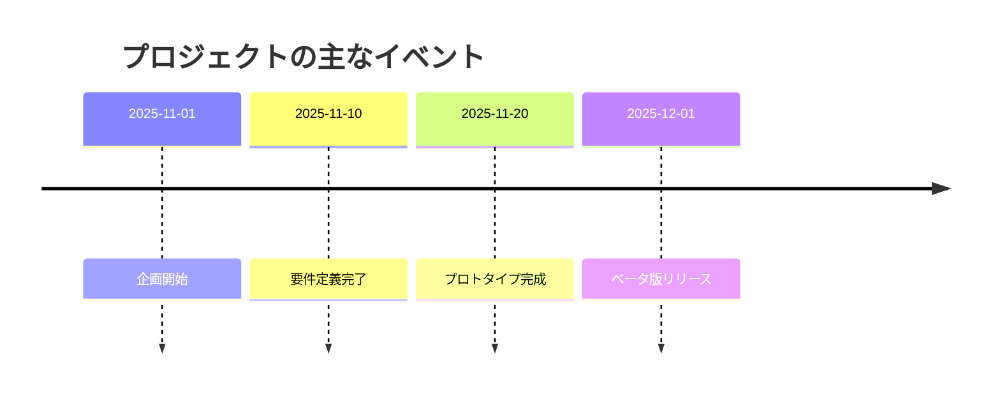

---
### 2-9. マインドマップ（mindmap）
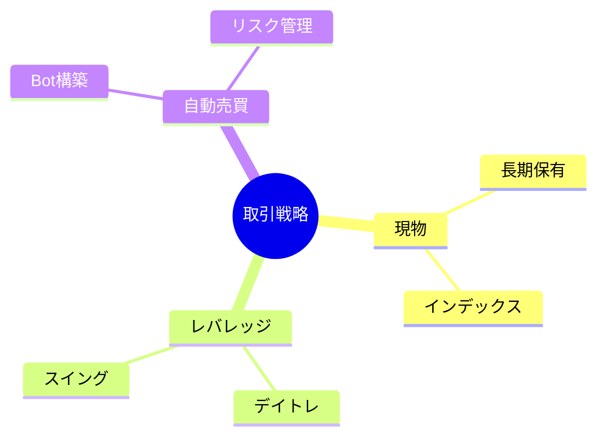

---
### 2-10. ユーザージャーニー図（journey）
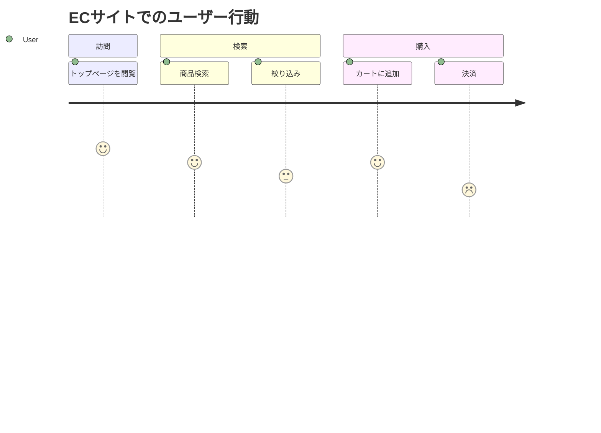


## links
* https://www.markdownguide.org/cheat-sheet/?utm_source=chatgpt.com
* https://qiita.com/Qiita/items/c686397e4a0f4f11683d?utm_source=chatgpt.com
