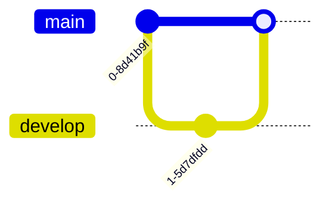

# md
how to md files.

## 書式
**太文字**

*斜体*

***太字斜体***

<u>ここに下線</u>
※githubでは表現不可(2025/11/15)

`ハイライト`

## Outline がカーソルを追いかけるようにする(VSCode)
* OUTLINE ペインの右上にある「カーソルに追従 (Follow Cursor)」アイコン をクリックしてオンにする
 
## マークダウンで表現できる図

※VSCode では「Markdown Preview Mermaid Support」 などの拡張機能を入れると、
mermaid … ブロックがプレビューで図として表示されます。

### 1-1. 画像（いわゆる“図”）


### テーブル
| 項目   | 説明               |
|--------|--------------------|
| 名前   | サンプル           |
| バージョン | 1.0            |

### 箇条書き
- プロジェクト
  - フロントエンド
    - React
  - バックエンド
    - Python
      - FastAPI

### チェックリスト
- [x] 要件定義
- [ ] 設計
- [ ] 実装
- [ ] テスト

### ディレクトリ構造の図（ASCIIアート）
```
project-root/
├─ src/
│ ├─ main.py
│ └─ utils.py
└─ README.md
```

### フローチャート（flowchart）

```mermaid
flowchart TD
    A[Start] --> B{ログイン済み?}
    B -->|Yes| C[ダッシュボード表示]
    B -->|No| D[ログイン画面へリダイレクト]
    C --> E[ログアウト]
    E --> B
```




---
### 2-2. シーケンス図（sequenceDiagram）

```mermaid
sequenceDiagram
    actor User
    participant Browser
    participant Server
    User->>Browser: URLを入力
    Browser->>Server: HTTP GET /index
    Server-->>Browser: HTMLレスポンス
    Browser-->>User: ページ表示
```


---
### 2-3. クラス図（classDiagram）


---
### 2-4. 状態遷移図（stateDiagram）

```mermaid
stateDiagram-v2
    [*] --> Idle
    Idle --> Loading : ボタン押下
    Loading --> Success : 取得成功
    Loading --> Error : 取得失敗
    Success --> Idle : 再読み込み
    Error --> Idle : 再試行
```


---
### 2-5. ER 図（erDiagram）


---
### 2-6. ガントチャート（gantt）

```mermaid
gantt
    title 開発スケジュール
    dateFormat YYYY-MM-DD
    section 設計
        要件定義 :a1, 2025-11-01, 3d
        詳細設計 :a2, after a1, 5d
    section 実装
        コーディング :b1, after a2, 7d
        単体テスト :b2, after b1, 5d
```


---
### 2-7. 円グラフ（pie）

```mermaid
pie showData
    title ポートフォリオ内訳
    "BTC" : 50
    "ETH" : 20
    "SOL" : 15
    "その他アルト" : 15
```



---
### 2-8. タイムライン（timeline）

```mermaid
timeline
    title プロジェクトの主なイベント
    2025-11-01 : 企画開始
    2025-11-10 : 要件定義完了
    2025-11-20 : プロトタイプ完成
    2025-12-01 : ベータ版リリース
```


---
### 2-9. マインドマップ（mindmap）

```mermaid
mindmap
    root((取引戦略))
        現物
            長期保有
            インデックス
        レバレッジ
            デイトレ
            スイング
        自動売買
            Bot構築
            リスク管理
```


---
### 2-10. ユーザージャーニー図（journey）

```mermaid
journey
    title ECサイトでのユーザー行動
    section 訪問
        トップページを閲覧 : 5:User
    section 検索
        商品検索 : 4:User
        絞り込み : 3:User
    section 購入
        カートに追加 : 4:User
        決済 : 2:User
```


## Mermaidで追加可能な図

### Git グラフ (gitGraph)
コミット履歴やブランチの流れを可視化


---

### 要求図 (requirementDiagram)
システム要件を構造化して表現


---

### C4 図 (C4Context)
システムアーキテクチャを表現


---

### Quadrant Chart (象限チャート)
4つの象限で項目を分類・評価


---

### XY Chart (散布図・折れ線グラフ)
時系列データや相関関係を可視化
```mermaid
xychart-beta
    title "Sales Trend"
    x-axis [jan, feb, mar, apr, may, jun]
    y-axis "Sales" 0 --> 100
    line [30, 45, 50, 65, 70, 80]
```

---

## Mermaid以外のマークダウン表現

### 数式 (LaTeX)
数学・物理の数式を表現

インライン: $E = mc^2$

ブロック:
$$
\int_{0}^{\infty} e^{-x} dx = 1
$$

---

### 絵文字
GitHubで利用可能

`:smile:` → 😊  
`:rocket:` → 🚀

---

### 脚注
長い説明や参照を本文外に記載

本文中の参照[^1]

[^1]: 脚注の内容をここに記載

## シーケンス図の基本


---

## さまざまな表現

### アクターとパーティシパント


---

### メッセージの種類


---

### ループと条件分岐


---

### 並列処理
```mermaid
sequenceDiagram
    participant User
    participant Frontend
    participant API1
    participant API2
    
    User->>Frontend: Submit form
    
    par Parallel requests
        Frontend->>API1: Request A
        Frontend->>API2: Request B
    end
    
    API1-->>Frontend: Response A
    API2-->>Frontend: Response B
    Frontend-->>User: Combined result
```

---

### アクティベーションとノート
```mermaid
sequenceDiagram
    participant Client
    participant Server
    
    Client->>+Server: Request
    Note right of Server: Processing request
    Server->>Server: Internal processing
    Note over Client,Server: Communication established
    Server-->>-Client: Response
```

---

## 実用例：認証フロー
```mermaid
sequenceDiagram
    actor User
    participant Frontend
    participant AuthAPI
    participant Database
    participant TokenService
    
    User->>Frontend: Enter credentials
    Frontend->>AuthAPI: POST /login
    activate AuthAPI
    AuthAPI->>Database: Query user
    Database-->>AuthAPI: User record
    
    alt Valid credentials
        AuthAPI->>TokenService: Generate JWT
        TokenService-->>AuthAPI: Token
        AuthAPI-->>Frontend: 200 OK + Token
        Frontend-->>User: Redirect to dashboard
    else Invalid credentials
        AuthAPI-->>Frontend: 401 Unauthorized
        Frontend-->>User: Show error
    end
    deactivate AuthAPI
```


## links
* [https://mermaid.js.org/](https://mermaid.js.org/intro/)
* https://www.markdownguide.org/cheat-sheet/?utm_source=chatgpt.com
* https://qiita.com/Qiita/items/c686397e4a0f4f11683d?utm_source=chatgpt.com
